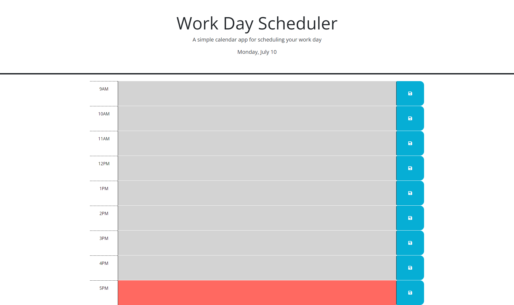

# Workday-Scheduler

## Description
This webpage allows users to plan their tasks in hour blocks within the day the page is accessed which is displayed in the header. Time blocks for each hour between 9AM to 5PM are displayed with editable text fields for the user to input their tasks for the respective hours. Once the save button is clicked for a filled-in text field, that text is saved in local storage and will remain displayed when the page is refreshed. Additionally, each hour block is color coded to represent whether that hour is past, present, or in the future.

## Credit
Thank you to my classmates, Lucas Wysoczanski and Daniel Lee, for partnering with me to work on this challenge. Here are their GitHub profiles--
Lucas Wysoczanski: https://github.com/LucasWyski001
Daniel Lee: https://github.com/drog41813

## Usage

https://micavilla.github.io/workday-scheduler/